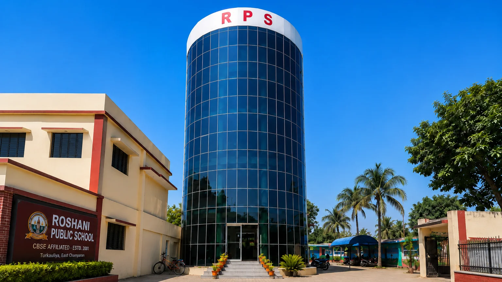

# Roshani Public School — Official Web Portal & School CMS



Official website and administrative CMS portal for **Roshani Public School** (CBSE Affiliated · Est. 2001), Turkaulia, East Champaran, Bihar - 845437.

---

## 🌟 Key Features

### 🏛️ Public School Website
- **Institutional Profile & Leadership**: Principal's message, vision, mission, and school values.
- **Academic Programs & Curriculum**: Pre-primary through Senior Secondary curriculum details and pedagogical philosophy.
- **Interactive Academic Calendar**: Dynamic filterable calendar with month/category filters and offline export.
- **Campus & Facilities Showcase**: Virtual exploration of smart classrooms, science labs, library, sports infrastructure, and transport.
- **Admissions Portal**: Online admission enquiry submission with automated feedback and instant admission modal alerts.
- **Notices & Circulars**: Centralized real-time dynamic notice board for parents and students with searchable archives.
- **Photo Gallery**: High-resolution categorized campus imagery, events, and laboratory photo galleries with full-screen lightbox modal.
- **Mandatory Disclosure**: CBSE Appendix-IX compliant mandatory disclosure portal with direct document downloads.
- **Contact & Map**: Real-time contact details, office hours, and interactive Google Maps direction embed.

### 🔐 Administrative Management System (CMS & ERP)
- **Role-Based Access Control**: Strict multi-tier authorization (`super_admin` and `admin`).
- **Real-Time School Identity Editor**: Modify school address, affiliation, phone, email, and principal information dynamically.
- **Notice Board Management**: Create, edit, publish, or archive school circulars with file attachments.
- **Event & Calendar Scheduler**: Add and manage school calendar events, examinations, and holidays.
- **Gallery Asset Manager**: Manage campus photo collections and showcase galleries.
- **Mandatory Disclosure Manager**: Upload and update statutory CBSE regulatory documents.
- **Parent Enquiry CRM**: Review, manage, and filter online admission inquiries with unread status tracking.
- **Immutable Audit Trail**: Automatic logging of administrative modifications for compliance and accountability.

---

## 🛠️ Technology Stack

- **Frontend**: Semantic HTML5, Vanilla CSS3 (Custom Design System), JavaScript (ES6+)
- **Backend & Database**: [Supabase](https://supabase.com/) (PostgreSQL Database, Storage, and Realtime API)
- **Typography & Icons**: Google Fonts (Inter, Merriweather, Playfair Display)
- **Deployment Targets**: GitHub Pages, Vercel, Netlify, or standard web servers

---

## 📂 Project Structure

```text
├── index.html                   # Homepage
├── about.html                   # About School & Leadership
├── academics.html               # Curriculum & Academic Streams
├── admissions.html              # Admissions Process & Forms
├── facilities.html              # Campus & Infrastructure
├── student-life.html            # Co-curricular Activities & Clubs
├── gallery.html                 # Photo & Campus Gallery
├── notices.html                 # Official Notices & Circulars
├── academic-calendar.html       # School Calendar 2026–27
├── mandatory-disclosure.html    # CBSE Mandatory Disclosure (Appendix IX)
├── contact.html                 # Contact Information & Map
├── 404.html                     # Custom 404 Error Page
│
├── admin/                       # Administration CMS Portal
│   ├── index.html               # Admin Dashboard
│   ├── login.html               # Admin Sign-In Portal
│   ├── school-information.html  # Institutional Settings & Principal Profile
│   ├── notices.html             # Notice Management
│   ├── events.html              # Calendar Event Management
│   ├── gallery.html             # Gallery Management
│   ├── mandatory-disclosure.html# Mandatory Disclosure Document Manager
│   ├── enquiries.html           # Parent Enquiries Inbox
│   ├── users.html               # Admin User Management
│   ├── audit-log.html           # Immutable Audit Logs
│   ├── settings.html            # Site Settings & Admission Popup Controls
│   └── profile.html             # Admin Profile & Credentials
│
├── assets/                      # Optimized Campus Imagery & Logos
├── css/                         # Custom Modular Stylesheets
│   ├── style.css                # Base Layout & Typography
│   ├── components.css           # UI Components & Buttons
│   ├── pages.css                # Page-specific Styling
│   └── admin.css                # Admin Dashboard Design System
│
├── js/                          # Application Logic & Supabase API
│   ├── supabase-client.js       # Centralized Database & Auth Layer
│   ├── public-app.js            # Dynamic Public Page Data Hydration
│   ├── navigation.js            # Mobile Menu & Header Navigation
│   ├── forms.js                 # Form Validation & Feedback
│   ├── admission-popup.js       # Dynamic Admission Modal
│   └── vercel-analytics.js      # Safe Telemetry Loader
│
├── data/
│   └── school-information.json  # Fallback Institutional Baseline Data
├── robots.txt                   # Search Engine Crawler Directives
└── sitemap.xml                  # XML Sitemap for Search Engines
```

---

## 🚀 Getting Started

### Local Development
To run and test the website locally, you can use any static HTTP server (such as Python, Node `serve`, or VS Code Live Server):

```bash
# Using Python
python -m http.server 3000

# Using Node.js npx
npx serve .
```

Open `http://localhost:3000` in your web browser.

---

## 🔒 Security & Privacy
- Sensitive credentials, API secret keys, and environment files (`.env`) are excluded via `.gitignore`.
- Public database interactions use Row Level Security (RLS) policies with the Supabase public anonymous key.
- Administration routes are protected by session tokens and role verification.

---

## 📄 License & Attribution
© 2026 **Roshani Public School**. All Rights Reserved.  
*Developed & Maintained by Ekaagra Technologies.*
